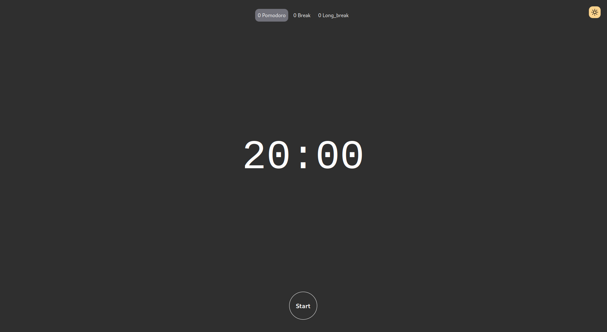
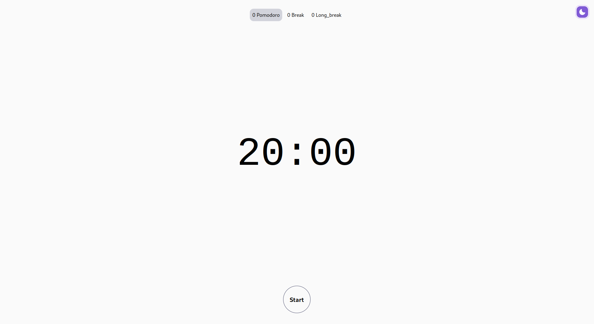

# Pomodoro - Tauri

Basic pomodoro application created with Tauri


## Badges


## Screenshots

### Dark mode



### Light mode




## Installation

Install my-project with npm

```bash
  git clone https://github.com/Arnaiz23/tauri-pomodoro.git
  cd tauri-pomodoro
  npm install
  npm run tauri build
```
    
## Run Locally

Clone the project

```bash
  git clone https://github.com/Arnaiz23/tauri-pomodoro.git
```

Go to the project directory

```bash
  cd tauri-pomodoro
```

Install dependencies

```bash
  npm install
```

Start the server

```bash
  npm run tauri dev
```


## Authors

- [@Arnaiz23](https://www.github.com/Arnaiz23)

